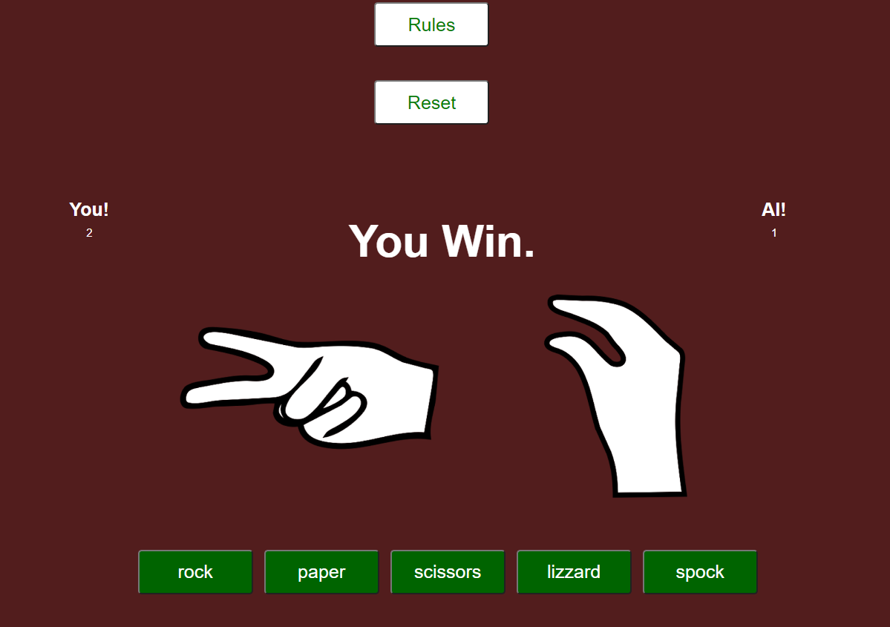

# Rock paper scissors lizard Spock game

[Link to Live Website](https://ejkington.github.io/lizard-spock-ms2/)

[GitHub Repo](https://github.com/ejkington/lizard-spock-ms2)

The game
-------
It is first used to settle a dispute about what to watch on TV between Sheldon and Raj in "The Lizard-Spock Expansion".
It is mentioned again in "The Euclid Alternative" and "The Rothman Disintegration", where Sheldon explains the rules to Penny and Barry Kripke.

The game was originally created by Sam Kass with Karen Bryla. According to an interview with Kass, the series producers did not originally ask for permission to use the game, but Kass was officially referenced by Sheldon as the creator of the game during the "The Rothman Disintegration", after which he states, "Hail Sam Kass!" to which Leonard, Howard, Raj, and Sheldon all then chant "Hail!" while raising their hands.

Rules
-------

<h3>How To Play The Game: </h3>

(1.) Scissors cuts Paper (✌ > ✋) 
(2.) Paper covers Rock (✋ > ✊) 
(3.) Rock crushes Lizard (✊ > 🦎) 
(4.) Lizard poisons Spock (🦎 > 🖖) 
(5.) Spock smashes Scissors (🖖 > ✌) 
(6.) Scissors decapitates Lizard (✌ > 🦎) 
(7.) Lizard eats Paper (🦎 > ✋) 
(8.) Paper disproves Spock (✋ > 🖖) 
(9.) Spock vaproizes Rock (🖖 > ✊) 
(10.) Rock crushes Scissors (✊ > ✌)

 
 
 ## Features 

A simple game of rock paper scissors lizzard spock.
  * Showing images of the button pressed.
  * Randomizes computers choice.
  * Display text if user wins or lose.
  * Score board.

  ### Existing Features

 ## Start Screen and Heading

  - Scoreboard at the top of the screen.
  - Header text presenting what game is to be played.
  - Start button.
  - Reset button to return to start screen and reset the score to 0.
  - Rules button to see the rules of the game.

 ## The Game Area

  - This section will allow the user to play the RPSLS game. The user will be able to easily see start button fading in to the game section ,  
  - Pressing the start button will fade in the game area and present the user with the choices presented with green buttons. 
  - An image of rock will be presented as default and will change accordingly to what button the user presses.
  - __The home screen__
   
  
  
  ## The score section

  - The score section is where the user will be able to see the score against the computer.
  
  
 
 ## The game section
 
  - The match section is where the game happens. buttons for each choice and the images of what the user choose and what the computer has choosen
 
 
  
  ## Testing 
 Test | Test action | Expected outcome      | Test outcome
------- | ---------------- | ---------- | ---------:
Correct images show up | Clicking the diffrent buttons | images changes according too button pressed | PASS
Scoreboard works  |  pressing a button        | score awarded to computer or user       | PASS
Start game button   | Clicking the start button from home screen | Home page fades out and match page fades in with a small delay    | PASS
Reset button    | Clicking the reset button  | directed back to startscreen and score resets    | PASS
Rules button    | Clicking the rules button | user is directed to page with rules of the game    | PASS
Play game button on rules page   | Clicking the play game button from rules page | returns user to homepage    | PASS
 
 
 
 
 
 * Bug where the expected outcome of a press would give a point to the loser.
 * Bug where rock would beat everything.

 
  
  ### Validator Testing 
  
  - HTML
    - No errors were returned when passing through the official [W3C validator](assets/images/readme-images/htmlvalidator.png)
    
   - CSS
    - No errors were found when passing through the official [(Jigsaw) validator](assets/images/readme-images/Cssvalidator.png)
  
   - JavaScript
      - esversion: 6 was used in this project
      - No errors were found when passing through the official [Jshint validator](https://jshint.com/)
      - The following metrics were returned: 
      - There are 9 functions in this file.
      - Function with the largest signature take 2 arguments, while the median is 0.
      - Largest function has 54 statements in it, while the median is 4.
      - The most complex function has a cyclomatic complexity value of 17 while the median is 1.
  
  ## Adding and commiting files

  To add files to the repository take the following steps

  In the command line type -
        git add .  
        git commit -m "This is being committed"
        git push

To add all new files or modified file use " ."  - To add a single file use the pathway to the file eg .index.html  or assets/css/style.css
When committing make sure your comments are clear about what changes have been made. 
Pushing will send your work to the repository

  
 ## Deployment 

The project was deployed with the following steps

* Logged into git hub
* Clicked the "Settings" button in the menu above the Repository.
* Scroll down the Settings page to the "GitHub Pages" Section.
* Under "Source", click the dropdown called "None" and then select "Master Branch".
* The page will automatically refresh, and a link displaced.  It may take some time for the link to show the website.
* If the page will not load go down to "template" under the "source" and select a template. 
* Scroll back down through the page to locate the now published site link in the "GitHub Pages" section.

The live link can be found here - https://ejkington.github.io/lizard-spock-ms2/
  
  
  ## Credits 

  - Brian Machina my mentor for guidens in project planing.
  - Slack community for help when i got stuck.
  - Ed Dev, youtuber.

  
  ### Content 

- The images in the game section were taken from https://www.youtube.com/watch?v=T_ZvWkMgVFM&ab_channel=TeCoEd
s

